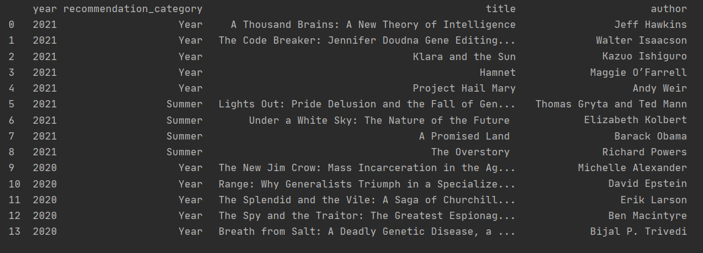

# Table of Contents
1. [Book scraping project](#book-scraping-project)
2. [Using this repository](#using-this-repository)
3. [Installation and configuration](#installation-and-configuration)


# Book scraping project

This project is aim to use the library BeautifulSoup on the website [gatesnotes](https://www.gatesnotes.com/) in order 
to get the site recommendations of books per year. This website hosts annual and summer book recommendations made by 
Bill Gates.

Due to the site is not scraping friendly, each year need's to have a different method since the access location to the 
books varies. For this reason you'll be able to extract book recommendation for 2020 and 2021.

The script will:
* Create the dataframe
* Populate the dataframe with recommendations of 2020
* Populate the dataframe with recommendations of 2021
* Return the dataframe




## Using this repository

To Run this repository locally:

* Clone the repository
    
* Run the following script
  ```shell script
  python books_2020_2021.py
  ```


## Installation and configuration
To run the script locally you will need to have installed:
* Python v.3.x.x
* Libraries
    * pandas:1.1.3
    * request:2.24.0
    * beautifulsoup4:4.9.3
